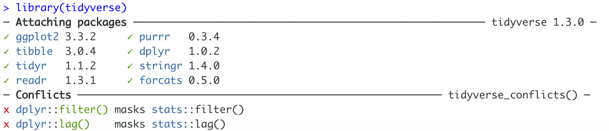

---
authors:
- admin
categories:
- Intro to R
date: "2021-03-01"
draft: false
featured: false
image:
  caption: 'Image credit: [**tidyver.org**](https://cdn.analyticsvidhya.com/wp-content/uploads/2019/05/tidyverse-default.png)'
  focal_point: ""
  placement: 1
  preview_only: false
lastmod: "2021-03-01T00:00:00Z"
projects: []
subtitle: "Welcome \U0001F44B First, we all know that statistician dedicate most of their time in tiding raw data before conducting any further analysis. It will be a tedious and inefficient process if all jobs are done manually. Therefore, the very first package that I'm going to introduce is the `tidyverse` package, the foundation of data wrangling."
summary: "Welcome \U0001F44B First, we all know that statistician dedicate most of their time in tiding raw data before conducting any further analysis. It will be a tedious and inefficient process if all jobs are done manually. Therefore, the very first package that I'm going to introduce is the `tidyverse` package, the foundation of data wrangling."
tags:
- Academic
title: Get to know the 'tidyverse' package in R
---

## General information about the tidyverse package

The `tidyverse` package is introduced by [**Hadley Wickham**](https://en.wikipedia.org/wiki/Hadley_Wickham) and his team that "share an underlying design philosophy, grammar, and data structures" of tidy data. 

## What is tidyverse?

The `tidyverse` package is actually a collection of essential R packages for data analysis, it contains several other packages (dplyr, ggplot2, etc.) which will be introduced in future blogs. The packages within `tidyverse` help statisticians to present and interact with the data. Specifically, one can but not limit to subset, transform or visualize data using packages within `tidyverse`.



## Get Started to use tidyverse in R

1. Use `install.packages('tidyverse')` to install the `tidyverse` package into your RStudio.
2. Use `library(tidyverse)` to tell R that you are going to use functions within the `tidyverse` package before actually doing so. \
After using the `library` function you should expect an output looks like as follow:

In the table, it presents all packages names and its version within the `tidyverse` package. There are 8 packages respond for different functionality, for example, `ggplot2` in charge of producing informative charts, graphs and visualizations; `dplyr` is dedicated to all sorts of data manipulation (i.e. selecting certain types of observations).

You might notice that there are some conflicts pop up in the output table, don't worry, this is totally normal. The only thing it is suggesting is that the `dplyr` package has two common function `filter()` and `log()` with the `stats` package. The result from each package is totally the same, R is presenting this only because it needs to know which package you want to use. One way to solve the problem is referring the specific package that the function is from when using it, for example using `dplyr::filter()` or `stats::filter()`.
