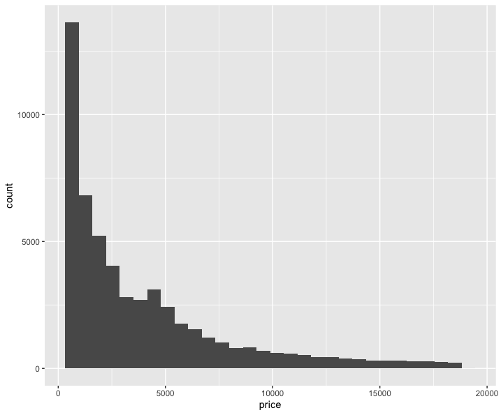
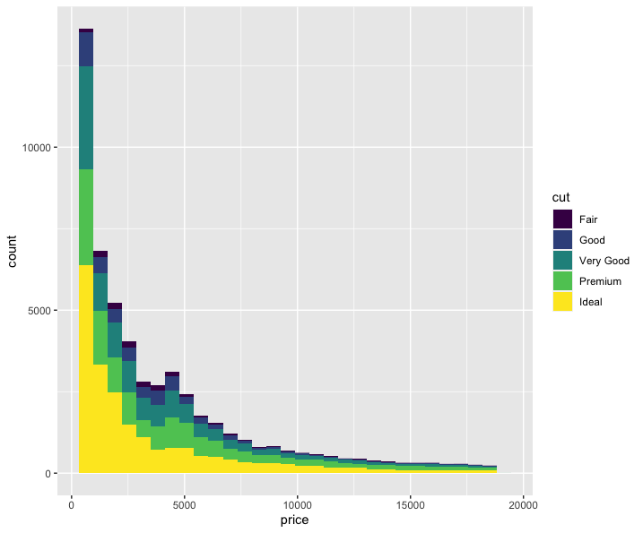
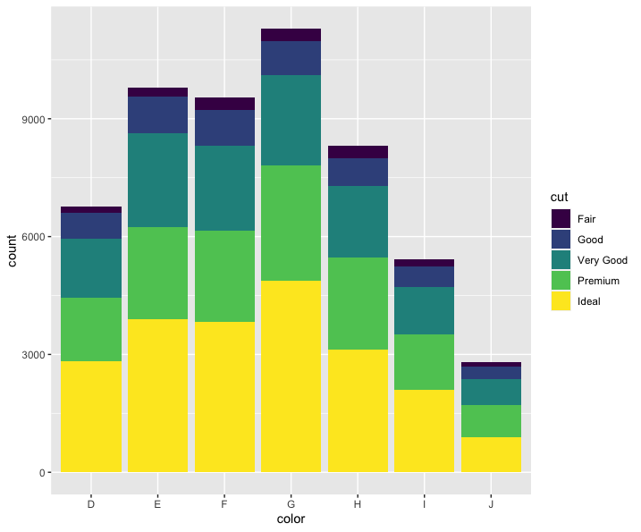
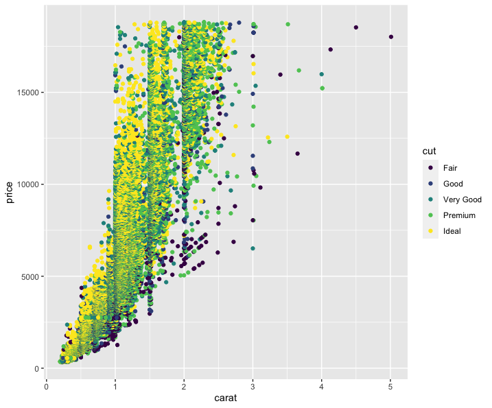
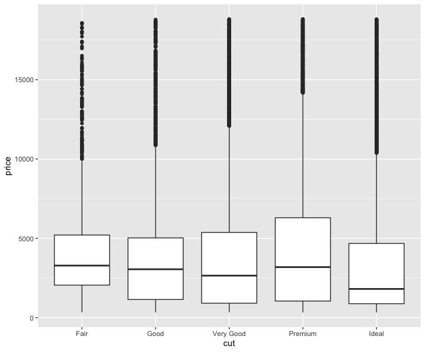

---
authors:
- admin
categories: [Intro to R]
date: "2021-03-20T00:00:00Z"
image:
  caption: ""
  focal_point: ""
lastMod: "2021-03-20T00:00:00Z"
projects: []
subtitle: The key to make beautiful graphs for your projects.
summary: 
tags:
- Academic
title: Intro to the 'ggplot2' package in R
---

## What does ggplot2 do?
Creating visualisations of data is a step in communicate information to others. `ggplot2` is a package in `tidyverse` that dedicated to create elegant data visualisations using the grammar of graphics. In this tutorial, you will learn to use `ggplot2` to make beautiful plots or charts of your data.

### Before we start to write any code, make sure you have called `library(tidyverse)` in your R. 

## Data and Mapping
In order to make a great plot, we need three components **Data**, **Aesthetics** and **Geometry**. In this section, we will focus on **Data** and **Aesthetics** and introduce different types of **Geometry** in the later section.

- Data: is basically the data we use to create plots. In this tutorial we use the inherent mtcars dataset and diamonds dataset as examples to make presentations of verbs in `ggplot2`.
 
- Aesthetics: or we can call it aesthetic mapping, it describe how variables in the data are mapped to visual properties (aesthetics) of geoms. `aes()` uses non-standard evaluation to capture the variable names. The color, shape, grouping of the graph can be mapped through the variables in the dataset.

Here we use the 'diamonds' dataset to illustrate how should we set up the plot using `ggplot()` and `aes()`. Suppose we want to present the relationship of the carat and the price of diamonds, (setting carat to be the x-variable and price be the y-ariable), the following code will do this favor:
``` r
ggplot(data = diamons, mapping = aes(x = carat, y = price))
``` 

## Geometry
Telling R information about data and aesthetic is not enough for creating plots, data and aesthetics just gives general information about what the plot should look like. A cruicial missing part is the type of plot the user wants to use, and it can be completed by using the geom functions. geom is actually a function family, it includes all kinds of plots (i.e. hisogram, scatterplot, barplot, etc.). 

For the geom function family, it usually has the following coding style:
``` r
geom_plotname(
  mapping = xxx,
  data = xxx,
  other characterized attributes)
)
```
Notice that, `mapping` and `data` can be written in `ggplot()`, then there is no need to repeat in `geom_plotname()`. Some typical plot types are `geom_bar()`, `geom_col()`, `geom_point()`, `geom_histogram()`, `geom_boxplot()`. We will demonstrate some of these plots later in the tutorial.

## Examples
## 1. geom_histogram()
Say we want to see the distribution of the diamond price, one suitable presentation is to use a histogram through the following code:
``` r
ggplot(data = diamonds, mapping = aes(x = price)) + 
geom_histogram()
```


The plot suggests that most diamond prices are concentrated on the left side, while the right tail has very few observations, we call it a right-skewed graph. Only looking at the distribution of diamond prices might be too boring, we could group diamonds by their `cut` and create a new plot.

``` r
ggplot(data = diamonds, mapping = aes(x = price, fill = cut)) + 
geom_histogram()
```


By adding `fill = cut` in `aes()` allows us to assign colors according to diamond's cut and makes the plot more informative. Also, after adding colors, each bar becomes clearer while the previous one looks like the bars are too crowded.

## 2. geom_bar()
Barplots have very similar properties with histograms, the difference is that the x-axis variable doesn't have to be continuous. Say we want to know the number of diamonds for different colors categorized by their cut and create a visualization of it.

``` r
ggplot(data = diamonds, mapping = aes(x = color, fill = cut)) +
geom_bar()
```


You can see that the code of creating a barplot is almost the same as the code of creating the histogram, and notice that `ggplot()` is the main component of creating plot.

## 3. geom_point()
Scatterplot is widely used in finding relationship between two variables, it provides visual intuition about the correlation between variables. Say we want to explore the relationship between the carat and the price of diamonds, categorized by its cut.

``` r
ggplot(data = diamonds, mapping = aes(x = carat, y = price, color = cut)) +
geom_point()
```


Although the plot looks a little bit messy, but we still can claim that there is a positive relationship between carat and price, (the bigger the diamond, the more expensive).

## 4. geom_boxplot()
The boxplot describes the distribution of variable values by drawing the total number of five observation data, namely the minimum, lower quartile, median, upper quartile and maximum. At the same time, the box graph can display outliers, and the box graph can easily identify outliers in the data. We can use boxplot to present the price of diamonds with different cut.

``` r
ggplot(data = diamonds, mapping = aes(x = cut, y = price)) +
geom_boxplot()
```



The plot shows that diamonds with 'Ideal' cuts has the lowest median price, while diamonds with 'Fair' and 'Premium' cuts has very similar median price. Besides, diamonds with 'Premium' cuts has the widest range of its 25th-percentile - 75th-percentile price.

## Summary
After this tutorial you should have a basic understanding of the functionality of `ggplot()` and `geom()` functions. Try to play with these plots and get familiar with its coding style. Hope you find this useful and see you in the next post. ✌🏻


