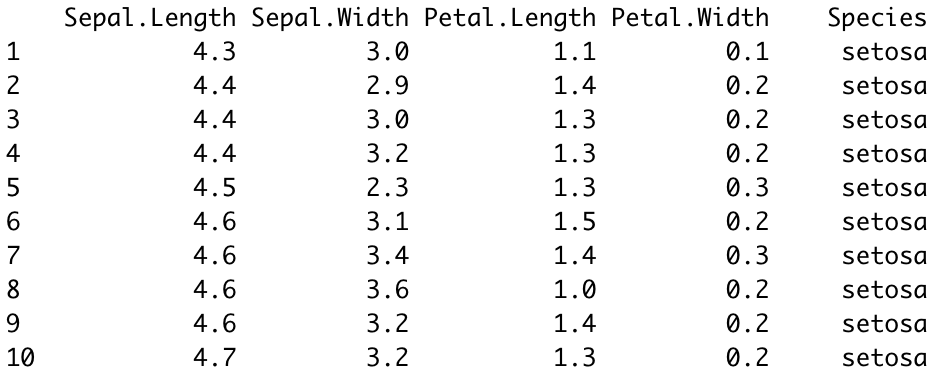
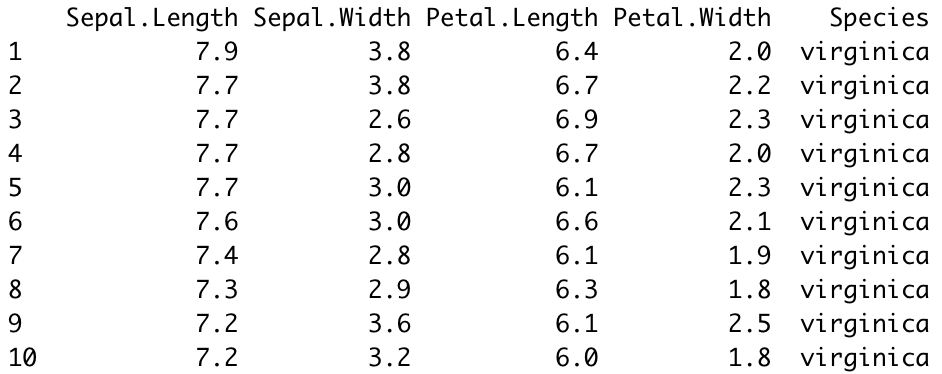
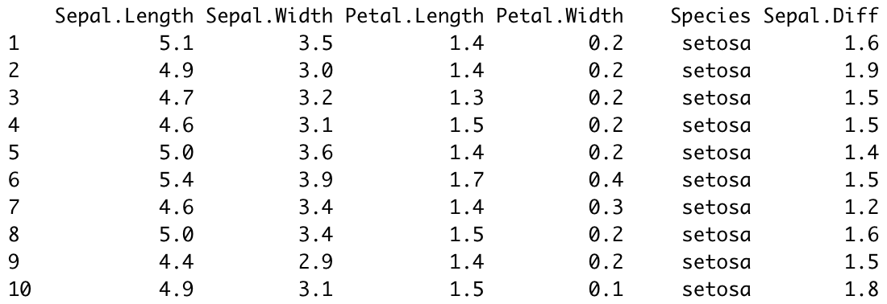
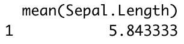
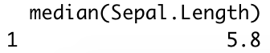

---
authors:
- admin
categories:
- Intro to R
date: "2021-03-13"
diagram: true
highlight: true
image:
  placement: 1
math: true
tags:
- Academic
title: Intro to the 'dplyr' package in R
---

`dplyr` is the core package in the `tidyverse` package that is used for data manipulation. There are five main functions used by statisticians to manipulate the raw data into the wanted form:

## 1. Use filter() to subset data row-wise.

`filter()` takes logical expressions (conditions specified by the user) and return rows that satisfied the condition from the original data frame.

The following example uses the default dataframe `iris` in R to show how `filter()` works in practice. This data set contains three plant species (setosa, virginica, versicolor) and four features measured for each sample. \
First of all, we need to load `iris` into R. 
``` r
library(datasets)
data("iris")
head(iris)
```
Calling `head(iris)` presents the first six rows of the data set. You should get the following output:


Then, suppose we only need observations with species 'virginica', we can achieve this by using the `filter()` function. `filter()` takes two inputs, the data and the conditions given by the user, `filter(data, conditions)`. In this example, the data is `iris` and the condition is `Species == 'virginica'`. So the complete code should be:
``` r
filter(iris, Species == 'virginica')
```
The output you expect to get will be like this:


The table here only presents the first ten rows of the result, there should be 50 rows in total with their `Species` all being 'virginica'.

## 2. Use select() to subset the data on variables or columns.

The functionality of `select()` is similar to `filter()`, the difference is that the former extract columns rather than rows. Besides, `select()` takes the data and varaibles as inputs instead of conditions specified by the user in `filter()`. The complete code follows this form: `select(data, variables)`. 

Back to the `iris` data. This time, say we only need to investigate two variables `Sepal.Length` and `Sepal.Width` from the whole data set. We can achieve this by using the following code:
``` r
select(iris, Sepal.Length, Sepal.Width) # make sure you type in the correct variable names
```

The output you expect to get will be like this:


Now, you have a smaller dataset that only contains information about `Sepal.Length` and `Sepal.Width`.

## 3. Use arrange() to sort the data

`arrange()` orders the rows of the data frame according to the values of selected columns. `arrange()` takes two parameters as its input, the data and the variable name.

Say we want to sort `iris` according to the `Sepal.Length` of each observation. Then we could write:
``` r
arrange(iris, Sepal.Length)
```

The output you expect to get will be like this:


You may have notice that the default setting of `arrange()` is put observations in an ascending order. You can also order the data in descending order by writing the following code:
``` r
# Using the desc() function
arrange(iris, desc(Sepal.Length))
# Using the nagtive sign, -
arrange(iris, -Sepal.Length)
```

Both writing style will generate the same result:


### 🎉We are more than half way done! Take a little break before you move on. We only have two more to go.


## 4. Use mutate() to create, modify and delete columns
`mutate()` adds new variables and preserves existing ones. `mutate()` takes three parameters as its input, the data, the new vraible name and the value that will be assigned to the new variable.

Say we want to create a new variable `Sepal.Diff` which is the different between the `Sepal.Length` and `Sepal.Width`. We can create this new variable by using the following code:
```r
mutate(iris, Sepal.Diff = Sepal.Length - Sepal.Width)
```

The output you expect to get will be like this:


You can see that there is one new column named `Sepal.Diff` in the data frame created by `mutate()`, and its value is calculated from `Sepal.Length - Sepal.Width`.

## 5. Use summarize() to summarize each group to fewer rows

summarize(), also known as summarise() creates a new data frame based on the original data frame. `summarize()` collapses all rows and returns a one-row summary. 

In the following example, you will see how does `summarize()` calculates the mean and median of `Sepal.Length` respectively.
``` r
summarize(iris, mean(Sepal.Length))
summarize(iris, median(Sepal.Length))
```

The output you expect to get will be like this:



Moreover, one common use of `summarize()` is to count the number of rows of the data frame by using `n()` in `summarize()`. \
\
Say, we want to know how many observations have `Sepal.Width` less than 3.0. Then we can first filter the data and then use `summarize` to count the number of rows.
``` r
iris %>%
filter(Sepal.Width < 3) %>%
summarize(n())
```
The output of the code should be 57.

Notice that the coding style has changed. I have used `%>%` (named pipe) in coding. `%>%` is another useful tool for R users to conduct multiple manipulations to the same data frame within one chunk of code.

## Summary
After this tutorial, you should be familiar with these 5 basic `dplyr` verbs and able to conduct some simple data manipulations. Hope you find this helpful and see you in the next tutorial. ✌🏻

### Did you find this page helpful? Consider sharing it 🙌
