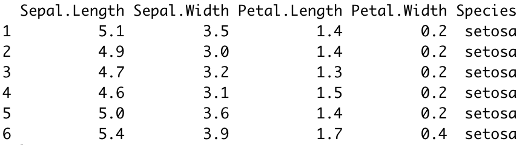
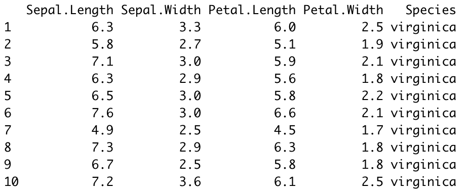
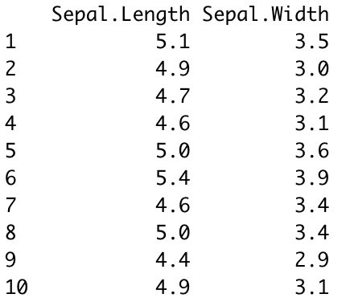

---
authors:
- admin
categories:
- Intro to R
date: "2021-03-13"
diagram: true
highlight: true
image:
  placement: 1
math: true
title: Intro to the 'dplyr' package in R
---

`dplyr` is the core package in the `tidyverse` package that is used for data manipulation. There are five main functions used by statisticians to manipulate the raw data into the wanted form:

## 1. Use filter() to subset data row-wise.

`filter()` takes logical expressions (conditions specified by the user) and return rows that satisfied the condition from the original data frame.

## Examples

The following example uses the default dataframe `iris` in R to show how `filter()` works in practice. This data set contains three plant species (setosa, virginica, versicolor) and four features measured for each sample. \
First of all, we need to load `iris` into R. 
``` r
library(datasets)
data("iris")
head(iris)
```
Calling `head(iris)` presents the first six rows of the data set. You should get the following output:


Then, suppose we only need observations with species 'virginica', we can achieve this by using the `filter()` function. `filter()` takes two inputs, the data and the conditions given by the user, `filter(data, conditions)`. In this example, the data is `iris` and the condition is `Species == 'virginica'`. So the complete code should be:
``` r
filter(iris, Species == 'virginica')
```
The output you expect to get will be like this:


The table here only presents the first ten rows of the result, there should be 50 rows in total with their `Species` all being 'virginica'.

## 2. Use select() to subset the data on variables or columns.

The functionality of `select()` is similar to `filter()`, the difference is that the former extract columns rather than rows. Besides, `select()` takes the data and varaibles as inputs instead of conditions specified by the user in `filter()`. The complete code follows this form: `select(data, variables)`. \

Back to the `iris` data. This time, say we only need to investigate two variables `Sepal.Length` and `Sepal.Width` from the whole data set. We can achieve this by using the following code:
``` r
select(iris, Sepal.Length, Sepal.Width) # make sure you type in the correct variable names
```

The output you expect to get will be like this:


Now, you have a smaller dataset that only contains information about `Sepal.Length` and `Sepal.Width`.

### Did you find this page helpful? Consider sharing it 🙌
